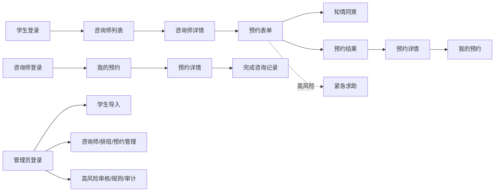

# 学校心理预约小程序三端高保真设计基线

版本：v1.0
日期：2026-07-10
状态：方向 1「呼吸线条」已选，进入全页面设计阶段
适用范围：学生端、咨询师端、后台管理端

视觉参考：[`direction-01-breathing-lines.png`](./references/direction-01-breathing-lines.png)

本文件先定义完整视觉和页面目标，不立即替换现有页面。后续按页面逐个还原，全部验收后再替换旧原型。

## 1. 设计目标

- 让学生在低压力、低认知负担的状态下完成预约。
- 让咨询师快速识别今天要处理的预约和风险提示。
- 让管理员在高密度数据中保持清晰的扫描和处理节奏。
- 三端共享同一套颜色、字体、图案和状态语义，但通过密度和强调色区分角色。
- 不做商业心理平台常见的评分、热度、排行、营销横幅和过度装饰。

## 2. 视觉语言

### 2.1 色彩令牌

| 令牌 | 色值 | 用途 |
| --- | --- | --- |
| `paper` | `#F8F7F1` | 页面底色、背景纹理底色 |
| `surface` | `#FEFDF9` | 面板、列表、表单区域 |
| `ink` | `#1F2A2D` | 标题、主要数据、主操作文字 |
| `muted` | `#6D7770` | 说明、辅助信息、次要时间 |
| `sage` | `#7B9476` | 学生端主色、确认状态、主按钮 |
| `sage-soft` | `#EDF2E9` | 主色弱背景、选中态 |
| `coral` | `#E97D6E` | 紧急求助、重要提醒、局部强调 |
| `amber` | `#D7A64D` | 待审核、注意事项、路径节点 |
| `blue` | `#719CB5` | 咨询师端辅助色、信息型状态 |
| `line` | `#D8DED7` | 分隔线、输入框边框、表格边框 |
| `danger` | `#C94D45` | 取消、拒绝、错误，不大面积使用 |

规则：不使用大面积渐变；不使用高饱和紫色；不把所有页面做成纯绿色；每个页面最多一个主色和一个强调色。

### 2.2 图案元素

- 呼吸线：两到四条细弧线，放在页面头部或底部，透明度低，不承载信息。
- 植物线稿：单线叶片或枝条，只作为页面锚点，不使用写实插画。
- 点阵：三乘三或四乘四小点阵，用于标记分组、空白区域和卡片角落。
- 路径线：短虚线和方形节点，用于咨询师详情、时段选择和管理端流程状态。
- 角标切口：只用于主行动区域或紧急求助区域，避免每个组件都使用。

图案必须低对比、可关闭、不遮挡文字；移动端首屏最多出现两组图案。

### 2.3 字体与排版

- 使用微信系统无衬线字体，后台沿用系统字体，不引入外部字体依赖。
- 页面标题 22-26px，移动端使用 20-22px；正文 14-16px，辅助文字 12-13px。
- 标题和正文使用正常字距，禁止负字距和装饰性大字距。
- 采用 8px 间距基线；移动端主要间距为 16/20/24px，后台为 12/16/20px。
- 普通页面不使用超大 Hero 标题，首屏优先展示任务和下一步操作。

## 3. 三端外壳

### 学生端

- 页面底色为 `paper`，底部保留“预约 / 我的”双 Tab。
- 头部使用短标题、简短说明和呼吸线，不使用大型品牌海报。
- 主按钮统一使用 `sage`；紧急求助使用 `coral` 的弱背景或线性图标。
- 咨询师和预约记录采用轻量行列表，不堆叠多层卡片。

### 咨询师端

- 保持学生端的基础语言，但增加 `blue` 作为信息和工作状态辅助色。
- 首屏优先显示“今天待处理”和“历史记录”，风险提示固定在预约行内。
- 记录填写页减少装饰，突出字段、保存状态和完成操作。

### 后台管理端

- 桌面端采用左侧功能导航加工作区；移动端导航变成横向滚动功能栏。
- 侧栏使用低对比点阵，工作区使用纸白底和细线分隔。
- 数据表格、筛选工具栏和抽屉详情优先使用行和分组，不使用营销式指标墙。
- 指标卡只保留管理决策所需数量，并用青绿、蓝、琥珀、珊瑚区分语义。

## 4. 共享组件

| 组件 | 设计要求 |
| --- | --- |
| 页面头部 | 标题、最多两行说明、一个次要操作；呼吸线放在标题下方或页脚 |
| 下一次预约 | 时间、咨询师、地点、状态同一行优先；点击进入详情 |
| 咨询师行 | 姓名、身份、擅长方向、最近可约时间、右侧箭头；不展示评分和热度 |
| 时段单元 | 日期分组、时间、地点、咨询方式；选中态使用 `sage-soft` 和边框 |
| 状态标签 | 已确认/已完成用主色；待审核用琥珀；已取消用中性灰；错误用危险红 |
| 主操作 | 每页最多一个；提交、继续、填写预约信息使用主色 |
| 危险操作 | 取消预约必须二次确认，按钮使用弱红背景，不使用大红底 |
| 空状态 | 说明当前没有数据，并给出一个合理的下一步 |
| 图案装饰 | 只放在外壳或分组边缘，不能成为点击目标和信息载体 |

## 5. 全页面设计清单

### 5.1 学生端

| 页面 | 路由 | 首屏结构 | 主操作 | 关键状态 |
| --- | --- | --- | --- | --- |
| 学生登录 | `pages/login/login` | 品牌短句、账号密码、隐私/须知入口、紧急求助 | 登录 | 默认、加载、失败、首次改密提示 |
| 咨询师列表 | `pages/student/counselors/index` | 下一次预约、快捷入口、筛选、咨询师行列表 | 查看咨询师详情 | 加载、空列表、请求失败 |
| 咨询师详情 | `pages/student/counselor-detail/index` | 资料摘要、擅长方向、简介、日期分组时段 | 填写预约信息 | 无时段、时段选中、时段失效 |
| 预约表单 | `pages/student/booking-form/index` | 已选咨询师/时段、必要信息、风险筛查、知情同意 | 提交预约 | 校验、锁定中、锁定失败、高风险 |
| 知情同意 | `pages/student/consent/index` | 保密边界、取消规则、风险说明、版本信息 | 返回预约表单 | 未读、已读、版本更新 |
| 紧急求助 | `pages/student/emergency/index` | 校内支持、值班渠道、外部紧急热线、当前危险提示 | 拨打/联系渠道 | 未登录可访问、信息加载失败 |
| 预约结果 | `pages/student/booking-result/index` | 成功/待审核状态、时间地点、下一步说明 | 查看预约详情 | 普通成功、高风险待处理、提交失败 |
| 我的预约 | `pages/student/appointments/index` | 当前预约、筛选、历史记录 | 查看详情 | 加载、空列表、筛选无结果 |
| 预约详情 | `pages/student/appointment-detail/index` | 状态头部、时间地点、咨询师、规则说明 | 取消预约 | 可取消、不可取消、已完成、高风险 |

学生端图案策略：登录页使用植物线稿；列表页使用呼吸线和点阵；详情页使用路径线；表单页减少装饰；结果页使用单个状态图形；紧急求助页使用珊瑚色线性警示标记。

### 5.2 咨询师端

| 页面 | 路由 | 首屏结构 | 主操作 | 关键状态 |
| --- | --- | --- | --- | --- |
| 咨询师登录 | `pages/counselor/login/index` | 咨询中心品牌、账号密码、角色说明 | 登录 | 默认、加载、失败 |
| 我的预约 | `pages/counselor/appointments/index` | 今日摘要、筛选、当前待处理、历史记录 | 查看预约详情 | 加载、空列表、风险提示 |
| 预约详情 | `pages/counselor/appointment-detail/index` | 学生基本信息、时间地点、风险等级、诉求摘要 | 填写完成记录 | 风险高亮、已取消、已完成 |
| 完成咨询记录 | `pages/counselor/complete-form/index` | 咨询摘要、处理结果、转介信息、保存提示 | 完成咨询 | 校验、保存中、保存成功、失败 |

咨询师端图案策略：登录页沿用植物线稿但改用蓝色节点；列表页使用短路径线；详情和记录页以表单分组为主，不使用大面积背景装饰。

### 5.3 后台管理端

| 页面 | 功能 | 首屏结构 | 主操作 | 关键状态 |
| --- | --- | --- | --- | --- |
| 管理员登录 | 管理员登录 | 左侧视觉引导、右侧表单 | 登录后台 | 登录失败、服务不可用 |
| 学生导入 | Excel 批量初始化账号 | 上传说明、文件选择、导入结果 | 上传并导入 | 预览、成功、逐行失败 |
| 咨询师管理 | 账号与可见状态 | 筛选、咨询师表格、创建表单 | 新建/编辑咨询师 | 空列表、保存成功、校验失败 |
| 排班时段 | 模板与时段生成 | 排班模板、生成区、时段结果 | 生成时段 | 冲突、生成成功、无可用时段 |
| 预约管理 | 查询和状态跟进 | 筛选工具栏、预约表格、详情抽屉 | 查看/更新状态 | 风险标记、取消、改派 |
| 高风险审核 | 审核、转介、关闭 | 风险队列、详情、处理表单 | 审核/转介/关闭 | 待处理、已处理、缺少信息 |
| 预约规则 | 规则版本维护 | 当前规则、编辑表单、版本列表 | 保存/启用规则 | 编辑、启用、版本冲突 |
| 审计日志 | 关键操作查询 | 筛选、日志表格、详情 | 查询日志 | 空结果、分页、敏感级别 |

管理端图案策略：登录页使用完整呼吸线构图；工作台侧栏使用点阵；每个页面只在标题区或空白区保留一组图案；表格和抽屉保持纯净。

## 6. 页面流转

## 7. 逐页还原计划

### 阶段 A：设计确认

1. 使用本文件和方向 1 参考图统一三端设计令牌。
2. 为 21 个页面补齐页面级高保真稿或可还原页面规格。
3. 确认学生端首屏、咨询师端工作台、管理端登录页作为三类基准页。

### 阶段 B：逐页还原

1. 学生端：登录 -> 咨询师列表 -> 咨询师详情 -> 预约表单 -> 结果/详情 -> 我的预约 -> 知情同意/紧急求助。
2. 咨询师端：登录 -> 预约列表 -> 预约详情 -> 完成咨询记录。
3. 管理端：登录 -> 学生导入 -> 咨询师 -> 排班 -> 预约 -> 风险 -> 规则 -> 审计。
4. 每完成一个页面，进行 390x844 或 1440x1024 截图、交互和接口回归。

### 阶段 C：统一替换

1. 三端页面全部完成后，统一替换旧原型样式和旧截图。
2. 复查登录、预约提交、取消、咨询完成、高风险审核和审计日志闭环。
3. 最终保留旧原型归档，不删除历史设计证据。

## 8. 验收标准

- 视觉：三端颜色、字体、状态语义和图案元素一致。
- 结构：页面首屏能看懂当前任务，主操作唯一且明确。
- 交互：加载、空、错误、成功、禁用和高风险状态完整。
- 响应式：学生端/咨询师端适配 390x844；管理端适配桌面和窄屏。
- 业务：不改变现有接口、权限、预约并发控制和风险审核逻辑。
- 替换：旧原型只在全部页面完成并通过截图验收后统一替换。
