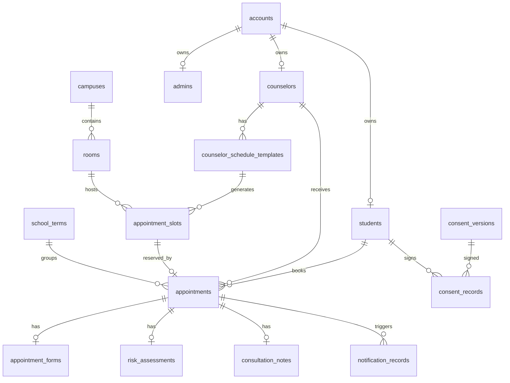

# 学校心理预约小程序 PRD + 页面原型结构 + 数据库表设计

版本：v0.1
日期：2026-07-04
适用场景：学校心理咨询中心面向本校学生提供心理咨询预约服务
前置调研：[心理预约微信小程序竞品调研.md](D:/项目开发/心理预约微信小程序竞品调研.md)

## 1. 项目定位

本项目是一个面向本校学生的心理咨询预约小程序，核心目标是让学生能安全、清晰、低压力地完成咨询预约，让咨询师能高效查看日程和处理个案，让管理端能动态管理规则、排班、学生账号、预约状态和统计报表。

本系统不做商业心理平台的下单、支付、销量、评价、排行榜逻辑。学校版应围绕“实名但对外保密、预约公平、规则透明、风险筛查、咨询伦理、后台可控”设计。

## 2. 已确认需求

| 项目 | 结论 |
| --- | --- |
| 服务对象 | 仅本校学生 |
| 登录方式 | 管理端通过 Excel 批量导入学生初始账号和初始密码 |
| 预约规则 | 由管理端动态配置 |
| 预约方式 | 学生自主选择咨询师 |
| 角色范围 | 学生端、咨询师端、后台管理端 |
| 前端路线 | 微信原生小程序 |
| 后端路线 | Spring Boot + MySQL + Redis |

## 3. 技术路线建议

推荐优先方案：

| 层级 | 建议 |
| --- | --- |
| 学生端 | 微信原生小程序 |
| 咨询师端 | 第一版可放在微信原生小程序内，通过角色切换展示；复杂记录能力后续迁移到 Web |
| 管理端 | Web 后台，推荐 Vue/React + API |
| 后端主方案 | Spring Boot + MySQL 8 + Redis |
| 后端备选 | 不作为主方案；Node.js/NestJS 和云开发仅作为后续局部能力或原型参考 |
| 云开发定位 | 不作为生产主后端；可用于原型验证或微信能力辅助集成 |
| 文件存储 | 私有对象存储，导入 Excel 和附件只允许授权访问 |
| 消息提醒 | 微信订阅消息，必要时扩展短信 |

为什么建议关系型数据库优先：

- 预约、排班、规则、学生、咨询师、咨询室之间关系强。
- 需要事务控制，避免同一时段重复预约。
- 管理后台需要复杂筛选、统计和导出。
- 敏感数据需要审计、权限、加密和可追踪访问。

## 4. 产品目标

### 4.1 学生目标

- 能用学校发放的账号密码登录并绑定微信。
- 能阅读并确认来访须知、保密原则和知情同意。
- 能查看咨询师信息，自主选择咨询师和可预约时段。
- 能提交预约诉求和风险筛查。
- 能查看预约状态、取消预约、接收提醒。
- 能在紧急情况下快速找到危机求助方式。

### 4.2 咨询师目标

- 能查看自己的预约日程。
- 能查看预约详情、学生基本信息、来访诉求和风险提示。
- 能确认完成咨询、记录简要咨询信息。
- 能管理个人可预约状态和临时不可用时间。

### 4.3 管理端目标

- 能批量导入学生初始账号。
- 能管理咨询师、校区、咨询室、服务类型和排班。
- 能动态配置预约规则。
- 能处理预约、取消、爽约、改派和风险队列。
- 能查看统计报表。
- 能审计敏感操作。

## 5. 非目标

MVP 不做以下功能：

- 在线支付、退款、优惠券。
- 咨询师公开评分、排名和评论。
- 商业化课程、会员、营销活动。
- AI 心理咨询替代专业咨询。
- 复杂心理量表和自动诊断。
- 学校统一身份认证，后续可作为替代登录方案接入。

## 6. 角色与权限

| 角色 | 权限范围 |
| --- | --- |
| 学生 | 登录、绑定微信、改密码、查看咨询师、预约、取消、查看自己的预约与通知 |
| 咨询师 | 查看本人日程、查看本人预约详情、处理本人咨询记录、设置临时不可用 |
| 管理员 | 学生导入、咨询师管理、排班、预约管理、规则配置、统计报表 |
| 超级管理员 | 角色权限、系统配置、敏感数据导出、审计日志 |
| 督导/中心负责人 | 可选角色，可查看授权咨询师的记录和风险处理 |

MVP 可以先实现学生、咨询师、管理员三类账号，超级管理员作为管理员的权限级别字段处理。

## 7. 核心业务规则

所有规则由后台动态管理，系统提供默认值。

| 规则 | 默认建议 | 是否后台可改 |
| --- | --- | --- |
| 单次咨询时长 | 50 分钟 | 是 |
| 最早可预约天数 | 14 天内 | 是 |
| 最晚预约时间 | 开始前 24 小时 | 是 |
| 最晚取消时间 | 开始前 24 小时 | 是 |
| 每周最大预约次数 | 1 次 | 是 |
| 每学期最大完成次数 | 8 次 | 是 |
| 同时存在的有效预约数 | 1 个 | 是 |
| 迟到判定 | 开始后 15 分钟 | 是 |
| 爽约限制阈值 | 累计 2 次后限制预约 | 是 |
| 高风险预约处理 | 进入人工审核队列 | 是 |
| 是否需要咨询师确认 | 默认否，预约即占用时段 | 是 |
| 是否允许学生取消 | 允许，受取消截止时间限制 | 是 |

## 8. 预约状态机

### 8.1 状态定义

| 状态 | 含义 |
| --- | --- |
| DRAFT | 草稿，学生尚未提交 |
| SUBMITTED | 已提交预约表单 |
| RISK_REVIEW | 风险待审核 |
| CONFIRMED | 预约成功 |
| COUNSELOR_REVIEW | 待咨询师确认，可由规则控制是否启用 |
| ADMIN_REVIEW | 待管理员处理 |
| CANCELED_BY_STUDENT | 学生取消 |
| CANCELED_BY_COUNSELOR | 咨询师取消 |
| CANCELED_BY_ADMIN | 管理员取消 |
| CHECKED_IN | 已签到 |
| NO_SHOW | 爽约 |
| COMPLETED | 咨询完成 |
| REFERRED | 已转介 |
| CLOSED | 已关闭/归档 |

### 8.2 正常流程

```text
学生登录
  -> 阅读须知/确认知情同意
  -> 选择咨询师
  -> 选择可约时段
  -> 填写预约表单
  -> 完成风险筛查
  -> 提交预约
  -> 系统判断规则和风险
  -> 预约成功 CONFIRMED
  -> 到访签到 CHECKED_IN
  -> 咨询师确认完成 COMPLETED
  -> 系统归档 CLOSED
```

### 8.3 高风险流程

```text
学生提交预约
  -> 风险筛查命中
  -> RISK_REVIEW
  -> 管理员/咨询师人工处理
  -> 允许预约 CONFIRMED
  或 转介 REFERRED
  或 关闭 CLOSED
```

### 8.4 取消和爽约

```text
CONFIRMED
  -> 学生在允许时间内取消 CANCELED_BY_STUDENT
  -> 咨询师临时停诊 CANCELED_BY_COUNSELOR
  -> 管理员改派/取消 CANCELED_BY_ADMIN
  -> 开始后超过迟到阈值且未签到 NO_SHOW
```

## 9. 学生端 PRD

### 9.1 登录与绑定

页面：学生登录页

功能：

- 输入学号和初始密码登录。
- 首次登录后强制修改密码。
- 修改密码后绑定微信 openid。
- 后续可使用微信静默登录，如果换设备或解绑则要求重新输入账号密码。
- 展示隐私政策和服务协议入口。

安全要求：

- Excel 导入的初始密码只允许后端哈希存储。
- 首次登录必须修改密码。
- 连续登录失败达到阈值后短时间锁定账号。
- 管理员可重置学生密码，重置后学生再次登录仍需改密。

### 9.2 首页

页面目标：

- 让学生快速看到下一次预约、预约入口、紧急求助和服务须知。

页面模块：

- 顶部：学生姓名、学院、账号状态。
- 下一次预约卡片：若存在有效预约，展示时间、咨询师、地点、状态、取消入口。
- 快捷入口：预约咨询、我的预约、服务须知、紧急求助。
- 公告：中心通知、放假停诊、预约规则调整。
- 咨询说明：保密原则、咨询边界、适用对象。

### 9.3 咨询师列表

页面目标：

- 支持学生自主选择咨询师，但避免商业化排名。

筛选条件：

- 校区。
- 咨询方式：线下、线上。
- 擅长方向：情绪压力、人际关系、学业压力、亲密关系、家庭关系、适应问题、职业发展等。
- 可约时间：今天、本周、未来两周。
- 性别，可选。

咨询师卡片展示：

- 头像。
- 姓名。
- 职称/身份。
- 擅长方向。
- 简短介绍。
- 近期可约时段数量。
- “查看详情”按钮。

不展示：

- 评分。
- 销量。
- 热度排名。
- 学生评价。

### 9.4 咨询师详情

页面模块：

- 基本信息：头像、姓名、职称、校区。
- 擅长领域。
- 咨询风格和受训背景。
- 可预约时段日历。
- 来访须知提醒。
- “选择该咨询师预约”按钮。

### 9.5 选择时段

页面模块：

- 周视图日期切换。
- 时段卡片：上午/下午/晚上，显示可约、已约满、不可约、停诊。
- 咨询地点：校区、咨询室。
- 咨询方式：线下/线上。
- 规则提示：最晚取消时间、迟到规则。

并发要求：

- 用户点击时段后先短暂锁定名额。
- 锁定时间建议 5-10 分钟。
- 超时未提交自动释放。

### 9.6 预约表单

字段建议：

| 字段 | 是否必填 | 说明 |
| --- | --- | --- |
| 是否首次咨询 | 是 | 首次/非首次 |
| 主要困扰类型 | 是 | 多选 |
| 困扰简述 | 是 | 300 字以内 |
| 希望获得的帮助 | 否 | 200 字以内 |
| 紧急程度 | 是 | 低/中/高 |
| 近期可联系时间 | 否 | 便于人工处理 |
| 是否同意知情同意 | 是 | 必须勾选 |

隐私要求：

- 列表页默认不展示困扰简述。
- 管理员查看困扰简述要记录审计日志。
- 导出默认不包含困扰简述和风险详情。

### 9.7 风险筛查

字段建议：

| 问题 | 类型 | 命中处理 |
| --- | --- | --- |
| 近期是否有伤害自己的想法 | 单选 | 是则进入风险审核 |
| 近期是否有伤害他人的想法 | 单选 | 是则进入风险审核 |
| 近期是否经历重大危机事件 | 单选 | 是则进入风险审核 |
| 是否正在精神科就诊 | 单选 | 可预约，但标记 |
| 是否正在服用精神科相关药物 | 单选 | 可预约，但标记 |
| 是否愿意被中心老师电话联系 | 单选 | 高风险时建议必填 |

高风险提示文案原则：

- 不吓唬学生。
- 明确系统会优先联系。
- 同时展示紧急热线和校内值班电话。

### 9.8 预约确认

页面展示：

- 咨询师。
- 日期时间。
- 地点/线上方式。
- 取消截止时间。
- 迟到和爽约规则。
- 表单摘要。
- 知情同意版本。

提交后：

- 正常风险：生成预约并占用时段。
- 高风险：生成记录但状态进入 RISK_REVIEW，不直接占用或可配置为临时锁定。
- 发送订阅消息授权请求。

### 9.9 我的预约

列表分类：

- 当前预约。
- 待审核。
- 历史预约。
- 已取消/爽约。

操作：

- 查看详情。
- 取消预约。
- 查看签到码/签到状态。
- 查看咨询须知。

限制：

- 历史预约只展示时间、咨询师、状态，不展示完整咨询记录。

### 9.10 紧急求助

页面内容：

- 校内心理中心电话。
- 校内值班电话。
- 校外危机热线。
- 校医院/合作医院信息。
- “当前情况非常紧急时，请直接联系线下人员或拨打紧急电话”的明确提示。

该页面不依赖登录，或者登录失效时仍可访问。

## 10. 咨询师端 PRD

### 10.1 首页/今日日程

模块：

- 今日预约数量。
- 待处理风险提醒。
- 当前/下一位预约。
- 日程列表：时间、学生脱敏信息、状态、地点。

学生信息展示原则：

- 默认展示姓名和学号后四位，手机号默认脱敏。
- 风险标签只展示等级，不在列表暴露详细描述。

### 10.2 预约详情

模块：

- 预约基本信息。
- 学生基础信息：姓名、学号、学院、班级、手机号脱敏。
- 预约表单。
- 风险筛查摘要。
- 历史次数、爽约次数。
- 操作：确认完成、标记未到、申请改约、填写咨询记录。

### 10.3 咨询记录

MVP 字段：

- 咨询主题。
- 咨询摘要。
- 风险变化。
- 后续建议。
- 是否需要转介。

权限：

- 仅当前咨询师、授权督导、超级管理员在审计下可查看。
- 管理员默认不可查看咨询记录正文。

### 10.4 临时不可用

功能：

- 咨询师可提交临时不可用时段。
- 若影响已有预约，进入管理员处理队列。
- 管理员决定取消、改派或联系学生。

## 11. 管理端 PRD

### 11.1 登录与权限

功能：

- 管理员账号登录。
- 角色权限控制。
- 操作日志。
- 敏感数据二次确认。

### 11.2 学生账号导入

Excel 模板字段：

| 字段 | 必填 | 说明 |
| --- | --- | --- |
| 学号 | 是 | 唯一账号 |
| 姓名 | 是 | 学生真实姓名 |
| 初始密码 | 是 | 导入后立即哈希，不保存明文 |
| 学院 | 是 | 统计和筛选 |
| 专业 | 否 | 可选 |
| 班级 | 否 | 可选 |
| 年级 | 否 | 可选 |
| 手机号 | 否 | 可后续学生补充 |
| 状态 | 否 | 默认启用 |

导入逻辑：

- 上传 Excel。
- 预校验：学号重复、必填缺失、格式错误。
- 预览错误行和可导入行。
- 确认导入。
- 生成导入批次记录。
- 对新增账号创建密码哈希，对已有账号按策略跳过或更新。

导入策略选项：

- 跳过已存在学号。
- 更新学生基础信息但不重置密码。
- 强制重置密码。

### 11.3 咨询师管理

功能：

- 新增/编辑咨询师。
- 设置头像、姓名、职称、简介、擅长方向、校区、咨询方式。
- 设置账号状态。
- 设置是否展示给学生。
- 设置最大日接待量。
- 查看咨询师预约统计。

### 11.4 校区与咨询室管理

功能：

- 校区管理。
- 咨询室管理。
- 咨询室可用状态。
- 线上咨询无需咨询室，可配置线上会议说明。

### 11.5 排班管理

功能：

- 按咨询师配置固定周排班。
- 按日期生成具体可约时段。
- 设置假期、停诊、特殊不可约。
- 支持批量复制排班。
- 支持管理员手动释放或锁定时段。

生成时段逻辑：

- 读取咨询师周排班模板。
- 读取规则中的咨询时长和间隔。
- 排除假期和不可用时间。
- 生成 appointment_slots。
- 已有预约的时段不可被删除，只能停用后由管理员处理预约。

### 11.6 预约管理

功能：

- 按状态、时间、咨询师、学院、风险等级筛选。
- 查看预约详情。
- 管理员取消。
- 管理员改派咨询师或时段。
- 标记爽约。
- 导出非敏感统计。

敏感控制：

- 查看困扰简述、风险详情、咨询记录正文需要记录日志。
- 导出默认不包含敏感文本。
- 导出敏感字段需超级管理员权限。

### 11.7 规则管理

配置项：

- 单次咨询时长。
- 时段间隔。
- 提前预约时间。
- 取消截止时间。
- 每周最大次数。
- 每学期最大次数。
- 同时有效预约数。
- 迟到阈值。
- 爽约限制阈值。
- 高风险处理方式。
- 是否启用咨询师确认。
- 是否允许线上咨询。
- 是否启用签到。

规则版本：

- 每次保存生成新版本。
- 预约单记录当时使用的规则版本。
- 避免规则调整影响历史预约解释。

### 11.8 风险队列

功能：

- 查看 RISK_REVIEW 预约。
- 查看风险筛查项。
- 记录处理意见。
- 转为正常预约。
- 转介。
- 关闭。
- 发送人工联系提醒。

安全要求：

- 风险队列访问权限单独控制。
- 风险详情不可出现在普通消息通知中。

### 11.9 知情同意管理

功能：

- 编辑知情同意版本。
- 发布新版本。
- 停用旧版本。
- 查看学生签署记录。

规则：

- 新版本发布后，学生再次预约前必须重新确认。
- 预约单保存对应签署版本。

### 11.10 统计报表

指标：

- 预约总量。
- 完成量。
- 取消量。
- 爽约量。
- 到访率。
- 咨询师工作量。
- 校区/咨询室使用率。
- 学院分布。
- 风险等级分布。
- 平均等待时间。

统计原则：

- 报表聚合展示，不暴露个人敏感内容。
- 学院等维度人数过少时应避免细分暴露。

## 12. 页面原型结构

### 12.1 学生端页面路由

```text
pages/
  login/index                 登录
  login/change-password       首次修改密码
  login/bind-wechat           绑定微信
  home/index                  首页
  notice/list                 公告列表
  notice/detail               公告详情
  consent/index               知情同意
  emergency/index             紧急求助
  counselor/list              咨询师列表
  counselor/detail            咨询师详情
  booking/slots               选择时段
  booking/form                预约表单
  booking/risk                风险筛查
  booking/confirm             确认预约
  booking/result              预约结果
  appointment/list            我的预约
  appointment/detail          预约详情
  appointment/cancel          取消预约
  profile/index               我的
  profile/security            账号安全
```

### 12.2 学生端首页线框

```text
┌────────────────────────┐
│ 你好，张同学             │
│ 心理咨询预约服务          │
├────────────────────────┤
│ 下一次预约卡片            │
│ 时间 / 咨询师 / 地点       │
│ [查看详情] [取消预约]      │
├────────────────────────┤
│ [预约咨询] [我的预约]      │
│ [服务须知] [紧急求助]      │
├────────────────────────┤
│ 中心公告                  │
│ - 假期值班安排             │
│ - 本周可约时段更新          │
├────────────────────────┤
│ 保密原则与咨询说明入口      │
└────────────────────────┘
```

### 12.3 咨询师列表线框

```text
┌────────────────────────┐
│ 筛选：校区 / 方向 / 时间    │
├────────────────────────┤
│ 咨询师卡片                 │
│ 头像 姓名 职称              │
│ 擅长：情绪压力、人际关系      │
│ 近期可约：4 个时段           │
│ [查看详情]                  │
├────────────────────────┤
│ 咨询师卡片                 │
└────────────────────────┘
```

### 12.4 预约确认线框

```text
┌────────────────────────┐
│ 确认预约                  │
├────────────────────────┤
│ 咨询师：李老师              │
│ 时间：7月8日 14:00-14:50   │
│ 地点：南校区心理中心 203     │
│ 取消截止：7月7日 14:00前    │
├────────────────────────┤
│ 表单摘要                  │
│ 困扰类型：学业压力           │
│ 紧急程度：中                │
├────────────────────────┤
│ ☑ 已阅读并同意知情同意       │
│ [提交预约]                 │
└────────────────────────┘
```

### 12.5 咨询师端页面路由

```text
teacher/
  dashboard/index             今日日程
  calendar/index              日历视图
  appointment/detail          预约详情
  note/edit                   咨询记录
  unavailable/list            临时不可用
  unavailable/edit            新增不可用
  profile/index               个人资料
```

### 12.6 管理端页面结构

```text
admin/
  login                       管理员登录
  dashboard                   数据概览
  students                    学生管理
  students/import             Excel 导入
  counselors                  咨询师管理
  campuses                    校区管理
  rooms                       咨询室管理
  schedules                   排班管理
  slots                       时段管理
  appointments                预约管理
  risk-review                 风险队列
  consent                     知情同意管理
  rules                       规则管理
  notices                     公告管理
  notifications               通知记录
  reports                     统计报表
  audit                       审计日志
  settings                    系统设置
```

## 13. 数据库设计

以下设计以 MySQL 8 为准，后端主方案确定为 Spring Boot + MySQL + Redis。若后续做原型或局部云能力，可按表名映射为集合，但生产主链路仍以关系型数据库、事务、权限和审计为准。

通用字段约定：

| 字段 | 类型 | 说明 |
| --- | --- | --- |
| id | BIGINT | 雪花 ID 或自增 ID |
| created_at | DATETIME | 创建时间 |
| updated_at | DATETIME | 更新时间 |
| deleted_at | DATETIME NULL | 软删除时间 |
| created_by | BIGINT NULL | 创建人 |
| updated_by | BIGINT NULL | 更新人 |
| version | INT | 乐观锁 |

敏感字段约定：

- 手机号、困扰简述、风险处理说明、咨询记录正文建议加密存储。
- 列表查询使用脱敏字段或后端脱敏。
- 访问敏感字段必须写入 audit_logs。

### 13.1 ER 关系概览



### 13.2 accounts 账号表

| 字段 | 类型 | 说明 |
| --- | --- | --- |
| id | BIGINT PK | 账号 ID |
| username | VARCHAR(64) UNIQUE | 学号/工号/管理员账号 |
| password_hash | VARCHAR(255) | 密码哈希 |
| role | VARCHAR(32) | STUDENT/COUNSELOR/ADMIN/SUPER_ADMIN |
| status | VARCHAR(32) | ACTIVE/DISABLED/LOCKED |
| wx_openid | VARCHAR(128) NULL | 微信 openid |
| wx_unionid | VARCHAR(128) NULL | 微信 unionid |
| force_password_change | TINYINT | 是否强制改密 |
| login_fail_count | INT | 连续失败次数 |
| locked_until | DATETIME NULL | 锁定截止 |
| last_login_at | DATETIME NULL | 最近登录时间 |
| password_changed_at | DATETIME NULL | 最近改密时间 |

索引：

- UNIQUE(username)
- UNIQUE(wx_openid)
- INDEX(role, status)

### 13.3 students 学生表

| 字段 | 类型 | 说明 |
| --- | --- | --- |
| id | BIGINT PK | 学生 ID |
| account_id | BIGINT UNIQUE | 关联 accounts |
| student_no | VARCHAR(64) UNIQUE | 学号 |
| name | VARCHAR(64) | 姓名 |
| gender | VARCHAR(16) NULL | 性别 |
| college | VARCHAR(128) | 学院 |
| major | VARCHAR(128) NULL | 专业 |
| class_name | VARCHAR(128) NULL | 班级 |
| grade | VARCHAR(32) NULL | 年级 |
| phone_encrypted | VARBINARY(512) NULL | 加密手机号 |
| status | VARCHAR(32) | ACTIVE/DISABLED/GRADUATED |
| no_show_count | INT | 爽约次数 |
| booking_restricted_until | DATETIME NULL | 限制预约截止 |

索引：

- UNIQUE(student_no)
- INDEX(college, grade)
- INDEX(status)

### 13.4 student_import_batches 学生导入批次

| 字段 | 类型 | 说明 |
| --- | --- | --- |
| id | BIGINT PK | 批次 ID |
| file_name | VARCHAR(255) | 文件名 |
| total_count | INT | 总行数 |
| success_count | INT | 成功数 |
| failed_count | INT | 失败数 |
| strategy | VARCHAR(32) | SKIP_EXISTING/UPDATE/RESET_PASSWORD |
| status | VARCHAR(32) | PARSED/CONFIRMED/FAILED |
| operator_id | BIGINT | 操作管理员 |

### 13.5 student_import_rows 导入明细

| 字段 | 类型 | 说明 |
| --- | --- | --- |
| id | BIGINT PK | 明细 ID |
| batch_id | BIGINT | 导入批次 |
| row_no | INT | Excel 行号 |
| student_no | VARCHAR(64) | 学号 |
| name | VARCHAR(64) | 姓名 |
| status | VARCHAR(32) | SUCCESS/FAILED/SKIPPED |
| error_message | VARCHAR(500) NULL | 错误信息 |

### 13.6 counselors 咨询师表

| 字段 | 类型 | 说明 |
| --- | --- | --- |
| id | BIGINT PK | 咨询师 ID |
| account_id | BIGINT UNIQUE | 关联账号 |
| name | VARCHAR(64) | 姓名 |
| avatar_url | VARCHAR(500) NULL | 头像 |
| title | VARCHAR(128) NULL | 职称/身份 |
| gender | VARCHAR(16) NULL | 性别 |
| campus_id | BIGINT NULL | 默认校区 |
| expertise_json | JSON | 擅长方向 |
| intro | TEXT | 简介 |
| training_background | TEXT NULL | 受训背景 |
| service_modes_json | JSON | 支持线下/线上 |
| max_daily_count | INT | 每日最大接待量 |
| is_visible | TINYINT | 是否在学生端展示 |
| status | VARCHAR(32) | ACTIVE/INACTIVE |

索引：

- INDEX(status, is_visible)
- INDEX(campus_id)

### 13.7 admins 管理员资料表

| 字段 | 类型 | 说明 |
| --- | --- | --- |
| id | BIGINT PK | 管理员 ID |
| account_id | BIGINT UNIQUE | 关联账号 |
| name | VARCHAR(64) | 姓名 |
| department | VARCHAR(128) NULL | 部门 |
| permission_scope_json | JSON | 权限范围 |

### 13.8 campuses 校区表

| 字段 | 类型 | 说明 |
| --- | --- | --- |
| id | BIGINT PK | 校区 ID |
| name | VARCHAR(128) | 校区名称 |
| address | VARCHAR(255) NULL | 地址 |
| status | VARCHAR(32) | ACTIVE/INACTIVE |

### 13.9 rooms 咨询室表

| 字段 | 类型 | 说明 |
| --- | --- | --- |
| id | BIGINT PK | 咨询室 ID |
| campus_id | BIGINT | 校区 |
| name | VARCHAR(128) | 咨询室名称 |
| location_desc | VARCHAR(255) | 位置说明 |
| status | VARCHAR(32) | ACTIVE/INACTIVE |

索引：

- INDEX(campus_id, status)

### 13.10 service_types 服务类型表

| 字段 | 类型 | 说明 |
| --- | --- | --- |
| id | BIGINT PK | 服务类型 ID |
| code | VARCHAR(64) UNIQUE | INDIVIDUAL/OFFLINE/ONLINE 等 |
| name | VARCHAR(128) | 展示名称 |
| duration_minutes | INT | 默认时长 |
| enabled | TINYINT | 是否启用 |

MVP 建议先启用个体咨询，线上咨询可作为开关。

### 13.11 school_terms 学期表

| 字段 | 类型 | 说明 |
| --- | --- | --- |
| id | BIGINT PK | 学期 ID |
| name | VARCHAR(128) | 学期名称，如 2026-2027 第一学期 |
| start_date | DATE | 学期开始日期 |
| end_date | DATE | 学期结束日期 |
| is_current | TINYINT | 是否当前学期 |
| status | VARCHAR(32) | ACTIVE/INACTIVE |

索引：

- INDEX(start_date, end_date)
- INDEX(is_current, status)

### 13.12 appointment_rule_sets 预约规则版本表

| 字段 | 类型 | 说明 |
| --- | --- | --- |
| id | BIGINT PK | 规则版本 ID |
| name | VARCHAR(128) | 规则名称 |
| settings_json | JSON | 规则详情 |
| is_active | TINYINT | 是否当前启用 |
| effective_from | DATETIME | 生效时间 |
| effective_to | DATETIME NULL | 失效时间 |
| published_by | BIGINT | 发布人 |

settings_json 示例：

```json
{
  "slotDurationMinutes": 50,
  "slotGapMinutes": 10,
  "maxBookingDaysAhead": 14,
  "minBookingHoursAhead": 24,
  "minCancelHoursAhead": 24,
  "maxWeeklyAppointments": 1,
  "maxSemesterCompletedAppointments": 8,
  "maxActiveAppointments": 1,
  "lateMinutes": 15,
  "noShowRestrictThreshold": 2,
  "requireCounselorConfirm": false,
  "enableCheckin": true,
  "highRiskAction": "RISK_REVIEW"
}
```

### 13.13 counselor_schedule_templates 排班模板表

| 字段 | 类型 | 说明 |
| --- | --- | --- |
| id | BIGINT PK | 模板 ID |
| counselor_id | BIGINT | 咨询师 |
| campus_id | BIGINT | 校区 |
| room_id | BIGINT NULL | 咨询室 |
| service_type_id | BIGINT | 服务类型 |
| day_of_week | TINYINT | 1-7 |
| start_time | TIME | 开始时间 |
| end_time | TIME | 结束时间 |
| effective_from | DATE | 生效开始 |
| effective_to | DATE NULL | 生效结束 |
| status | VARCHAR(32) | ACTIVE/INACTIVE |

索引：

- INDEX(counselor_id, day_of_week, status)

### 13.14 counselor_unavailable_periods 不可用时间表

| 字段 | 类型 | 说明 |
| --- | --- | --- |
| id | BIGINT PK | ID |
| counselor_id | BIGINT | 咨询师 |
| start_at | DATETIME | 开始 |
| end_at | DATETIME | 结束 |
| reason | VARCHAR(255) NULL | 原因 |
| status | VARCHAR(32) | ACTIVE/CANCELED |

索引：

- INDEX(counselor_id, start_at, end_at)

### 13.15 appointment_slots 可预约时段表

| 字段 | 类型 | 说明 |
| --- | --- | --- |
| id | BIGINT PK | 时段 ID |
| counselor_id | BIGINT | 咨询师 |
| campus_id | BIGINT | 校区 |
| room_id | BIGINT NULL | 咨询室 |
| service_type_id | BIGINT | 服务类型 |
| start_at | DATETIME | 开始时间 |
| end_at | DATETIME | 结束时间 |
| status | VARCHAR(32) | AVAILABLE/LOCKED/BOOKED/DISABLED |
| locked_by_student_id | BIGINT NULL | 临时锁定学生 |
| locked_until | DATETIME NULL | 锁定截止 |
| appointment_id | BIGINT NULL | 已预约记录 |

索引：

- UNIQUE(counselor_id, start_at, end_at)
- INDEX(status, start_at)
- INDEX(campus_id, start_at)

并发控制：

- 提交预约时必须在事务中更新 slot。
- 只允许 AVAILABLE 或本人未过期 LOCKED 的 slot 被预约。
- 更新时带 version 或使用行锁。

### 13.16 appointments 预约主表

| 字段 | 类型 | 说明 |
| --- | --- | --- |
| id | BIGINT PK | 预约 ID |
| appointment_no | VARCHAR(64) UNIQUE | 预约编号 |
| student_id | BIGINT | 学生 |
| counselor_id | BIGINT | 咨询师 |
| slot_id | BIGINT | 时段 |
| campus_id | BIGINT | 校区 |
| room_id | BIGINT NULL | 咨询室 |
| service_type_id | BIGINT | 服务类型 |
| semester_id | BIGINT | 所属学期 |
| start_at | DATETIME | 预约开始时间，冗余自时段 |
| end_at | DATETIME | 预约结束时间，冗余自时段 |
| rule_set_id | BIGINT | 当时规则版本 |
| consent_record_id | BIGINT | 知情同意记录 |
| status | VARCHAR(32) | 预约状态 |
| risk_level | VARCHAR(32) | LOW/MEDIUM/HIGH |
| cancel_reason | VARCHAR(500) NULL | 取消原因 |
| canceled_by | BIGINT NULL | 取消人账号 |
| canceled_at | DATETIME NULL | 取消时间 |
| checked_in_at | DATETIME NULL | 签到时间 |
| completed_at | DATETIME NULL | 完成时间 |

索引：

- INDEX(student_id, status, created_at)
- INDEX(counselor_id, start_at)
- INDEX(status, created_at)
- INDEX(risk_level, status)

说明：如果数据库需要按时间排序，可冗余 start_at/end_at 到 appointments，减少关联查询。

### 13.17 appointment_forms 预约表单表

| 字段 | 类型 | 说明 |
| --- | --- | --- |
| id | BIGINT PK | 表单 ID |
| appointment_id | BIGINT UNIQUE | 预约 ID |
| first_visit | TINYINT | 是否首次咨询 |
| issue_types_json | JSON | 困扰类型 |
| description_encrypted | VARBINARY(4096) | 困扰简述 |
| expected_help_encrypted | VARBINARY(2048) NULL | 希望获得帮助 |
| urgency_level | VARCHAR(32) | LOW/MEDIUM/HIGH |
| contact_time | VARCHAR(255) NULL | 可联系时间 |

### 13.18 risk_assessments 风险筛查表

| 字段 | 类型 | 说明 |
| --- | --- | --- |
| id | BIGINT PK | 风险记录 ID |
| appointment_id | BIGINT UNIQUE | 预约 ID |
| self_harm | TINYINT | 是否有自伤想法 |
| harm_others | TINYINT | 是否有伤人想法 |
| crisis_event | TINYINT | 是否有近期危机事件 |
| psychiatric_treatment | TINYINT | 是否精神科就诊 |
| medication | TINYINT | 是否服药 |
| willing_contact | TINYINT | 是否愿意电话联系 |
| risk_level | VARCHAR(32) | LOW/MEDIUM/HIGH |
| review_status | VARCHAR(32) | NONE/PENDING/APPROVED/REFERRED/CLOSED |
| reviewed_by | BIGINT NULL | 处理人 |
| reviewed_at | DATETIME NULL | 处理时间 |
| handling_notes_encrypted | VARBINARY(4096) NULL | 处理备注 |

索引：

- INDEX(risk_level, review_status)

### 13.19 consent_versions 知情同意版本表

| 字段 | 类型 | 说明 |
| --- | --- | --- |
| id | BIGINT PK | 版本 ID |
| version_no | VARCHAR(32) UNIQUE | 版本号 |
| title | VARCHAR(255) | 标题 |
| content | MEDIUMTEXT | 内容 |
| status | VARCHAR(32) | DRAFT/PUBLISHED/ARCHIVED |
| published_at | DATETIME NULL | 发布时间 |

### 13.20 consent_records 知情同意签署表

| 字段 | 类型 | 说明 |
| --- | --- | --- |
| id | BIGINT PK | 签署记录 ID |
| student_id | BIGINT | 学生 |
| consent_version_id | BIGINT | 知情同意版本 |
| agreed_at | DATETIME | 同意时间 |
| client_info | VARCHAR(255) NULL | 客户端信息 |

索引：

- INDEX(student_id, consent_version_id)

### 13.21 checkins 签到表

| 字段 | 类型 | 说明 |
| --- | --- | --- |
| id | BIGINT PK | 签到 ID |
| appointment_id | BIGINT UNIQUE | 预约 |
| student_id | BIGINT | 学生 |
| checkin_at | DATETIME | 签到时间 |
| method | VARCHAR(32) | QR/MANUAL |
| late_minutes | INT | 迟到分钟 |
| operator_id | BIGINT NULL | 手动签到人 |

### 13.22 consultation_notes 咨询记录表

| 字段 | 类型 | 说明 |
| --- | --- | --- |
| id | BIGINT PK | 咨询记录 ID |
| appointment_id | BIGINT UNIQUE | 预约 |
| student_id | BIGINT | 学生 |
| counselor_id | BIGINT | 咨询师 |
| topic_encrypted | VARBINARY(1024) | 主题 |
| summary_encrypted | VARBINARY(8192) | 摘要 |
| risk_change | VARCHAR(32) NULL | 风险变化 |
| follow_up_plan_encrypted | VARBINARY(4096) NULL | 后续建议 |
| need_referral | TINYINT | 是否需要转介 |
| status | VARCHAR(32) | DRAFT/SUBMITTED/LOCKED |

索引：

- INDEX(student_id, counselor_id)
- INDEX(appointment_id)

### 13.23 referrals 转介记录表

| 字段 | 类型 | 说明 |
| --- | --- | --- |
| id | BIGINT PK | 转介 ID |
| appointment_id | BIGINT NULL | 关联预约 |
| student_id | BIGINT | 学生 |
| counselor_id | BIGINT NULL | 咨询师 |
| referral_type | VARCHAR(32) | HOSPITAL/HOTLINE/SCHOOL_CRISIS/OTHER |
| destination | VARCHAR(255) | 转介去向 |
| reason_encrypted | VARBINARY(4096) | 转介原因 |
| status | VARCHAR(32) | OPEN/COMPLETED/CANCELED |

### 13.24 notices 公告表

| 字段 | 类型 | 说明 |
| --- | --- | --- |
| id | BIGINT PK | 公告 ID |
| title | VARCHAR(255) | 标题 |
| content | MEDIUMTEXT | 内容 |
| status | VARCHAR(32) | DRAFT/PUBLISHED/ARCHIVED |
| publish_at | DATETIME NULL | 发布时间 |
| expire_at | DATETIME NULL | 过期时间 |

### 13.25 notification_records 通知记录表

| 字段 | 类型 | 说明 |
| --- | --- | --- |
| id | BIGINT PK | 通知 ID |
| recipient_account_id | BIGINT | 接收账号 |
| appointment_id | BIGINT NULL | 关联预约 |
| channel | VARCHAR(32) | WECHAT_SUBSCRIBE/SMS/IN_APP |
| template_code | VARCHAR(128) | 模板编码 |
| content_json | JSON | 发送内容 |
| status | VARCHAR(32) | PENDING/SENT/FAILED |
| sent_at | DATETIME NULL | 发送时间 |
| fail_reason | VARCHAR(500) NULL | 失败原因 |

### 13.26 audit_logs 审计日志表

| 字段 | 类型 | 说明 |
| --- | --- | --- |
| id | BIGINT PK | 日志 ID |
| actor_account_id | BIGINT | 操作人 |
| action | VARCHAR(128) | 操作 |
| target_type | VARCHAR(64) | 目标类型 |
| target_id | BIGINT NULL | 目标 ID |
| sensitive_level | VARCHAR(32) | NORMAL/SENSITIVE/HIGH |
| ip | VARCHAR(64) NULL | IP |
| user_agent | VARCHAR(500) NULL | UA |
| detail_json | JSON | 详情 |
| created_at | DATETIME | 操作时间 |

索引：

- INDEX(actor_account_id, created_at)
- INDEX(target_type, target_id)
- INDEX(sensitive_level, created_at)

## 14. 核心接口草案

### 14.1 学生端 API

```text
POST /api/student/auth/login
POST /api/student/auth/change-password
POST /api/student/auth/bind-wechat
GET  /api/student/home
GET  /api/student/consent/current
POST /api/student/consent/agree
GET  /api/student/counselors
GET  /api/student/counselors/{id}
GET  /api/student/counselors/{id}/slots
POST /api/student/slots/{id}/lock
POST /api/student/appointments
GET  /api/student/appointments
GET  /api/student/appointments/{id}
POST /api/student/appointments/{id}/cancel
GET  /api/student/emergency
```

### 14.2 咨询师端 API

```text
GET  /api/teacher/dashboard
GET  /api/teacher/appointments
GET  /api/teacher/appointments/{id}
POST /api/teacher/appointments/{id}/complete
POST /api/teacher/appointments/{id}/no-show
GET  /api/teacher/notes/{appointmentId}
POST /api/teacher/notes
GET  /api/teacher/unavailable
POST /api/teacher/unavailable
DELETE /api/teacher/unavailable/{id}
```

### 14.3 管理端 API

```text
POST /api/admin/auth/login
POST /api/admin/students/import/parse
POST /api/admin/students/import/confirm
GET  /api/admin/students
GET  /api/admin/counselors
POST /api/admin/counselors
PUT  /api/admin/counselors/{id}
GET  /api/admin/schedules
POST /api/admin/schedules
POST /api/admin/slots/generate
GET  /api/admin/appointments
GET  /api/admin/appointments/{id}
POST /api/admin/appointments/{id}/cancel
POST /api/admin/appointments/{id}/reassign
GET  /api/admin/risk-reviews
POST /api/admin/risk-reviews/{id}/handle
GET  /api/admin/rules
POST /api/admin/rules
GET  /api/admin/reports/overview
GET  /api/admin/audit-logs
```

## 15. 开发优先级

### 15.1 第一阶段：可预约闭环

- 学生账号导入。
- 学生登录、改密、微信绑定。
- 咨询师管理。
- 排班和时段生成。
- 学生查看咨询师和时段。
- 预约提交。
- 我的预约。
- 管理员预约管理。
- 咨询师查看日程。

### 15.2 第二阶段：规则和风险

- 动态预约规则。
- 知情同意版本。
- 风险筛查和风险队列。
- 取消、迟到、爽约限制。
- 微信订阅消息。
- 审计日志。

### 15.3 第三阶段：运营和安全增强

- 签到。
- 咨询记录。
- 转介。
- 统计报表。
- 敏感字段加密。
- 数据导出审批。

## 16. 验收标准

### 16.1 学生端

- 学生可用导入账号首次登录并强制修改密码。
- 学生可绑定微信，后续无需每次输入账号密码。
- 学生不能预约已满、停诊、超出规则限制的时段。
- 学生提交高风险表单后进入风险审核，不按普通预约直接完成。
- 学生只能查看自己的预约。

### 16.2 咨询师端

- 咨询师只能看到自己的预约。
- 咨询师能查看预约详情和风险等级。
- 咨询师不能查看其他咨询师的咨询记录。

### 16.3 管理端

- 管理员能导入 Excel 并看到错误行。
- 管理员能配置规则并生成新规则版本。
- 管理员能管理排班、时段和预约。
- 管理员查看敏感详情会产生审计日志。
- 统计报表不泄露学生敏感内容。

## 17. 待确认问题

这些问题不影响启动开发，但会影响后续细节：

1. 学校是否有多个校区和多个咨询室。
2. 咨询是否允许线上方式。
3. 是否要启用签到码。
4. 是否需要督导角色。
5. 是否需要短信提醒。
6. 咨询记录是否必须上系统，还是只做预约不记录正文。
7. 初始密码规则由学校提供，还是系统生成后导出给管理员。

## 18. 下一步建议

建议下一步直接拆成开发任务：

1. 初始化 Spring Boot 后端工程、MySQL 数据库和 Redis。
2. 建立账号、角色、学生、咨询师、排班、时段、预约等核心表。
3. 先做管理端学生 Excel 导入和咨询师排班。
4. 再做学生端预约闭环。
5. 最后补风险队列、审计、通知和报表。
