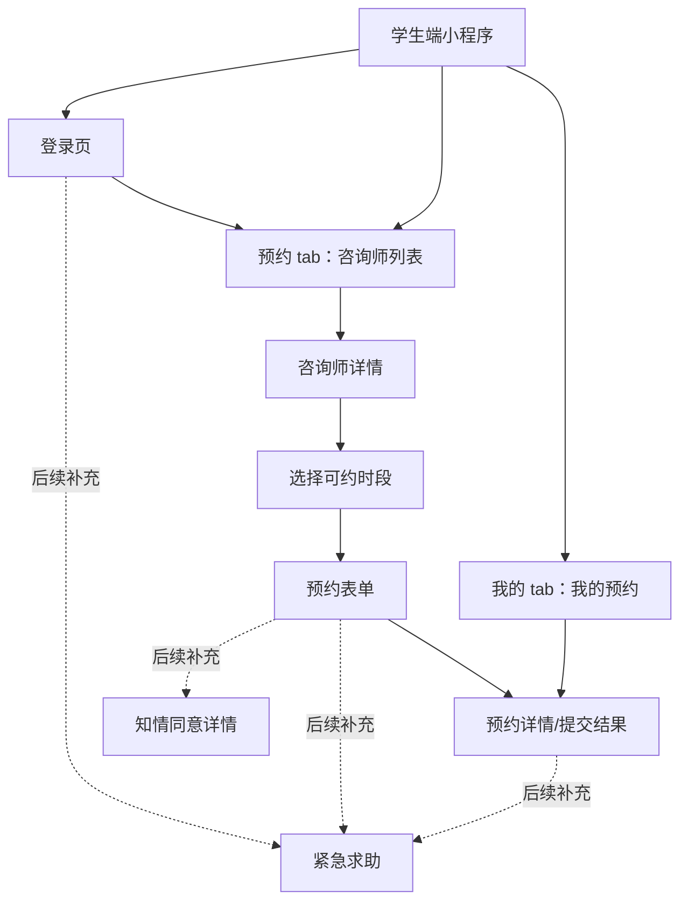
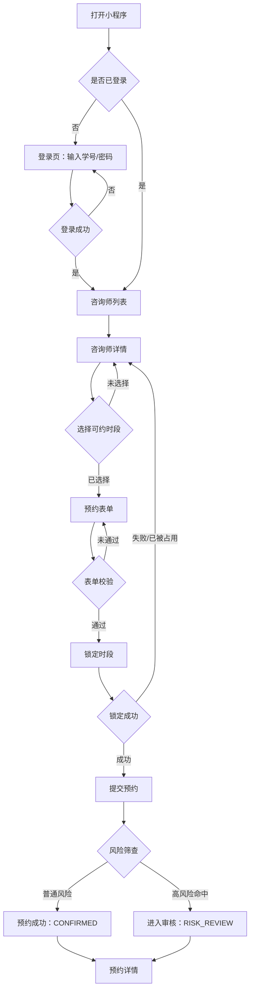
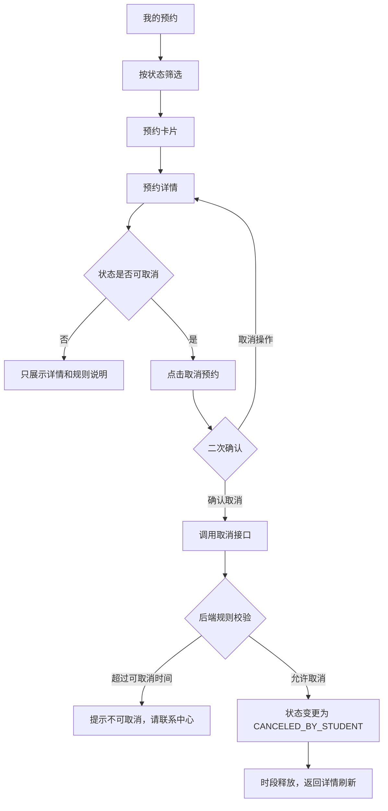

# 学生端页面原型设计稿说明 + 页面流转图

版本：v0.1
日期：2026-07-04
适用范围：学校心理预约微信原生小程序学生端
当前依据：`psych-appointment-miniprogram` 学生端工程骨架、后端已完成接口、学校心理预约 PRD

## 1. 设计简报

学生端面向本校学生，不做商业化心理平台的“售卖、排行、评价、营销”逻辑。页面目标是让学生低压力地完成三件事：登录、选择咨询师并提交预约、查看和取消自己的预约。

当前阶段输出的是低保真页面原型设计稿说明，不是高保真视觉稿。它用于统一页面结构、字段、操作、状态、跳转和接口映射，后续可以继续扩展为 Figma/墨刀原型或直接优化微信小程序 UI。

设计基调：

- 安静、克制、可信，避免营销化和强刺激表达。
- 优先展示时间、地点、咨询师信息和预约状态。
- 对风险筛查、知情同意、取消规则保持明确但不制造焦虑。
- 列表页默认不展示学生困扰明文，详情页也只展示学生本人提交的信息。
- 高风险命中时展示“已提交，中心将优先处理”的中性反馈，不用恐吓式文案。

当前小程序全局样式基准：

| 项目 | 建议 |
| --- | --- |
| 背景色 | `#f6f7f9` |
| 主色 | `#216b62` |
| 正文色 | `#17202a` |
| 标题色 | `#101828` |
| 次级文字 | `#667085` |
| 边框色 | `#e6e9ef` |
| 警示色 | `#b54708` |
| 危险操作色 | `#b42318` |
| 圆角 | 页面卡片 12rpx，按钮/输入框 10rpx |

## 2. 当前页面清单

MVP 当前采用两栏 tab：预约、我的。第一次进入或登录失效时进入登录页。

| 页面 | 路由 | 当前状态 | 页面目标 |
| --- | --- | --- | --- |
| 学生登录 | `pages/login/login` | 已有骨架 | 使用学校导入的学号和密码登录 |
| 咨询师列表 | `pages/student/counselors/index` | 已有骨架，作为预约首页 | 查看未来两周可约咨询师 |
| 咨询师详情 | `pages/student/counselor-detail/index` | 已有骨架 | 查看咨询师资料并选择时段 |
| 预约表单 | `pages/student/booking-form/index` | 已有骨架 | 填写预约诉求、风险筛查和知情同意 |
| 我的预约 | `pages/student/appointments/index` | 已有骨架 | 查看预约记录和状态 |
| 预约详情 | `pages/student/appointment-detail/index` | 已有骨架 | 查看预约详情，符合规则时取消预约 |

后续建议补充页面：

| 页面 | 建议路由 | 优先级 | 原因 |
| --- | --- | --- | --- |
| 紧急求助 | `pages/student/emergency/index` | 高 | 高风险学生或未登录学生也应能快速获得校内外求助信息 |
| 知情同意详情 | `pages/student/consent/index` | 高 | 预约前应可阅读完整说明，不只勾选一句话 |
| 修改密码 | `pages/student/change-password/index` | 中 | 初始账号密码导入后，正式上线应支持首次强制改密 |
| 服务须知 | `pages/student/service-guide/index` | 中 | 解释保密边界、取消规则、迟到爽约规则 |

## 3. 信息架构

学生端首要路径是“预约”，次要路径是“我的预约”。紧急求助应在登录页、预约表单风险筛查区、预约详情页作为固定入口出现。

## 4. 主预约流程

## 5. 我的预约与取消流程

## 6. 页面原型说明

### 6.1 学生登录页

路由：`pages/login/login`
接口：`POST /api/student/auth/login`

页面目标：让学生使用学校发放的初始账号密码进入系统。当前不做注册入口，因为学生账号由后台 Excel 批量导入。

页面结构：

| 区域 | 内容 |
| --- | --- |
| 顶部品牌区 | 标识“心”、标题“学校心理预约”、简短说明 |
| 登录表单 | 学号输入框、密码输入框 |
| 主操作 | 登录按钮 |
| 底部帮助 | 忘记密码联系心理中心或辅导员 |

状态设计：

| 状态 | 表现 |
| --- | --- |
| 默认 | 输入框为空，按钮可点击但提交时校验 |
| 加载中 | 登录按钮 loading，输入不丢失 |
| 登录失败 | toast 提示后端错误，不清空学号，清空或保留密码由安全策略决定 |
| 登录失效跳转 | 由全局请求层清 token 后回到该页 |

后续增强：

- 首次登录强制修改密码。
- 增加“紧急求助”弱按钮，未登录也可访问。
- 增加隐私政策和服务须知入口。

### 6.2 咨询师列表页

路由：`pages/student/counselors/index`
接口：`GET /api/student/counselors?from=&to=`

页面目标：作为 MVP 的预约首页，让学生看到未来两周内可以预约的咨询师，并进入详情页。

页面结构：

| 区域 | 内容 |
| --- | --- |
| 页面头部 | 标题“选择咨询师”、说明“查看未来两周可预约的咨询师和时段”、退出按钮 |
| 咨询师卡片列表 | 姓名、职称/身份、校区、擅长方向、可约时段数、最近可约时间 |
| 空状态 | 暂无可预约咨询师，请稍后再试 |

卡片规则：

- 不展示评分、销量、热度、学生评价。
- 可约时段数用于提示可预约性，不做排名暗示。
- 点击整张卡进入咨询师详情。

状态设计：

| 状态 | 表现 |
| --- | --- |
| 加载中 | 页面中央提示“正在加载咨询师” |
| 空列表 | 展示空状态，后续可补“查看服务须知”和“紧急求助” |
| 有数据 | 按后端返回顺序展示，后续可增加校区、方向、日期筛选 |
| 请求失败 | toast 提示，保留页面可下拉刷新 |

后续增强：

- 增加筛选条：校区、擅长方向、日期、咨询方式。
- 增加顶部“我的下一次预约”摘要卡。
- 增加公告或停诊提示。

### 6.3 咨询师详情页

路由：`pages/student/counselor-detail/index`
接口：

- `GET /api/student/counselors/{id}?from=&to=`
- `GET /api/student/counselors/{id}/slots?from=&to=`

页面目标：帮助学生了解咨询师资料，选择一个可预约时段。

页面结构：

| 区域 | 内容 |
| --- | --- |
| 咨询师资料面板 | 姓名、职称、校区、可约时段数、擅长方向、简介、培训背景 |
| 可预约时段区 | 时段卡片，展示日期时间、校区和咨询室 |
| 底部主操作 | 选择时段后启用“填写预约信息” |

交互规则：

- 未选择时段时，底部按钮禁用。
- 点击时段卡片后高亮当前选择。
- 点击“填写预约信息”进入预约表单，并通过 query 传递 `slotId`、`counselorId`、时段文字、咨询师姓名。

状态设计：

| 状态 | 表现 |
| --- | --- |
| 加载中 | 正在加载详情 |
| 无时段 | 咨询师资料仍展示，时段区显示“暂无可预约时段” |
| 时段已选 | 时段卡片高亮，主按钮可用 |
| 时段被占用 | 当前页不实时锁定，提交表单前锁定失败时返回或提示重新选择 |

后续增强：

- 按日期分组展示时段，减少长列表压力。
- 增加“咨询方式”标签：线下/线上。
- 增加“返回列表继续选择”的次要操作。

### 6.4 预约表单页

路由：`pages/student/booking-form/index`
接口：

- `POST /api/student/appointments/slots/{slotId}/lock`
- `POST /api/student/appointments`

页面目标：收集预约所需的最低必要信息，完成风险筛查和知情同意后提交。

页面结构：

| 区域 | 内容 |
| --- | --- |
| 顶部摘要 | 咨询师姓名、已选时间 |
| 基础表单 | 是否首次咨询、主要困扰、情况说明、期待帮助、紧急程度、方便联系时间 |
| 风险筛查 | 自伤想法、伤害他人想法、重大危机事件、精神科就诊、服药等 |
| 知情同意 | 勾选确认已阅读并同意 |
| 底部主操作 | 提交预约 |

表单校验：

| 字段 | 规则 |
| --- | --- |
| 是否首次咨询 | 必填 |
| 主要困扰 | MVP 可选，但正式版建议至少选择一项或填写情况说明 |
| 情况说明 | 建议必填，限制 1000 字以内 |
| 紧急程度 | 必填，默认中等 |
| 知情同意 | 必须勾选 |

提交逻辑：

1. 前端本地校验。
2. 调用 slot lock 接口锁定时段。
3. 锁定成功后提交预约表单。
4. 成功后跳转预约详情页。
5. 如果锁定失败，提示该时段已不可约，请返回重新选择。

风险筛查反馈：

| 命中情况 | 反馈文案原则 |
| --- | --- |
| 普通风险 | “预约已提交成功，请按时到访。” |
| 高风险 | “信息已提交，心理中心将优先处理并可能联系你。若当前情况紧急，请立即联系校内值班人员或紧急热线。” |

后续增强：

- 增加完整知情同意页面并记录版本。
- 高风险勾选时展示紧急求助入口。
- 增加提交前确认页，展示取消截止时间和到访规则。
- 增加倒计时提示：时段已为你临时保留。

### 6.5 我的预约页

路由：`pages/student/appointments/index`
接口：`GET /api/student/appointments?status=`

页面目标：让学生快速查看当前预约、待审核预约、历史预约和取消状态。

页面结构：

| 区域 | 内容 |
| --- | --- |
| 页面头部 | 标题“我的预约”、说明 |
| 状态筛选 | 全部、已确认、风险审核、已完成、已取消 |
| 预约卡片 | 咨询师、状态标签、时间、地点 |
| 空状态 | 暂无预约记录 |

卡片规则：

- 点击卡片进入预约详情。
- 列表不展示学生提交的困扰说明。
- 状态颜色按语义区分：确认/完成为主色，审核为警示色，取消为中性色或危险弱化色。

状态设计：

| 状态 | 表现 |
| --- | --- |
| 加载中 | 正在加载预约 |
| 空列表 | 暂无预约记录 |
| 筛选切换 | 立即刷新列表 |
| 请求失败 | toast 提示，可下拉刷新 |

后续增强：

- 默认分组：当前预约、待处理、历史记录。
- 增加“再次预约”入口，但不绕过每周/有效预约限制。
- 增加预约提醒开关或订阅消息授权入口。

### 6.6 预约详情页

路由：`pages/student/appointment-detail/index`
接口：

- `GET /api/student/appointments/{appointmentId}`
- `POST /api/student/appointments/{appointmentId}/cancel`

页面目标：展示单次预约的完整状态和必要信息，并在规则允许时提供取消入口。

页面结构：

| 区域 | 内容 |
| --- | --- |
| 顶部状态面板 | 咨询师、时间、状态标签 |
| 基础信息 | 预约号、地点、服务类型、风险等级 |
| 预约信息 | 是否首次、紧急程度、方便联系、困扰类型 |
| 取消原因 | 仅取消类状态展示 |
| 底部操作 | 可取消状态下展示“取消预约” |

可取消状态：

- `CONFIRMED`
- `RISK_REVIEW`
- `COUNSELOR_REVIEW`
- `ADMIN_REVIEW`

取消交互：

1. 点击取消预约。
2. 弹出二次确认，说明“取消后该时段将释放”。
3. 调用取消接口。
4. 成功后刷新详情。
5. 如果后端拒绝，展示具体原因，例如超过取消截止时间。

后续增强：

- 显示取消截止时间。
- 显示到访须知和咨询室定位说明。
- 对 `RISK_REVIEW` 状态显示更明确的处理说明。
- 已完成预约不展示咨询记录正文，只显示完成状态。

## 7. 状态标签规范

| 后端状态 | 学生端显示 | 标签类型 | 学生可感知说明 |
| --- | --- | --- | --- |
| `CONFIRMED` | 已确认 | 主色 | 预约成功，请按时到访 |
| `RISK_REVIEW` | 待审核 | 警示 | 中心将优先处理，必要时联系你 |
| `COUNSELOR_REVIEW` | 待咨询师确认 | 警示 | 等待咨询师确认 |
| `ADMIN_REVIEW` | 待处理 | 警示 | 等待中心处理 |
| `COMPLETED` | 已完成 | 主色/中性 | 咨询已完成 |
| `CANCELED_BY_STUDENT` | 已取消 | 中性 | 你已取消该预约 |
| `CANCELED_BY_ADMIN` | 中心已取消 | 中性 | 中心已处理取消 |
| `REFERRED` | 已转介 | 警示/中性 | 中心已进行后续处理 |
| `CLOSED` | 已关闭 | 中性 | 记录已关闭 |

## 8. 组件规范

| 组件 | 用途 | 设计要求 |
| --- | --- | --- |
| 页面标题 | 每页主标题 | 短句，直接说明当前任务 |
| 说明文字 | 页面副标题 | 不超过两行，避免教育式长文 |
| 面板 `panel` | 承载表单或详情信息 | 白底、细边框、轻圆角 |
| 卡片 `card` | 咨询师、预约记录 | 点击区域清晰，信息密度适中 |
| 标签 `tag` | 状态、可约数量 | 语义颜色稳定，不用过强饱和色 |
| 筛选 chip | 预约状态筛选 | 当前选中态明确 |
| 时段卡片 | 可约时间选择 | 选中态必须明显，禁用态后续补充 |
| 底部主按钮 | 提交、下一步 | 每页最多一个主按钮 |
| 危险按钮 | 取消预约 | 使用弱危险背景，必须二次确认 |
| 空状态 | 无数据 | 给出下一步建议，不只说“暂无” |

## 9. 接口映射

| 页面 | 触发时机 | 接口 |
| --- | --- | --- |
| 登录页 | 点击登录 | `POST /api/student/auth/login` |
| 咨询师列表 | 页面加载、下拉刷新 | `GET /api/student/counselors?from=&to=` |
| 咨询师详情 | 页面加载 | `GET /api/student/counselors/{id}?from=&to=` |
| 咨询师详情 | 页面加载 | `GET /api/student/counselors/{id}/slots?from=&to=` |
| 预约表单 | 提交前 | `POST /api/student/appointments/slots/{slotId}/lock` |
| 预约表单 | 锁定成功后 | `POST /api/student/appointments` |
| 我的预约 | 页面加载、筛选切换 | `GET /api/student/appointments?status=` |
| 预约详情 | 页面加载、取消成功后刷新 | `GET /api/student/appointments/{appointmentId}` |
| 预约详情 | 点击取消并确认 | `POST /api/student/appointments/{appointmentId}/cancel` |

## 10. 异常与边界

| 场景 | 前端处理 |
| --- | --- |
| token 失效 | 清理本地 token，返回登录页 |
| 时段锁定失败 | 提示“该时段已不可约，请重新选择” |
| 重复有效预约 | 展示后端规则原因，引导查看“我的预约” |
| 超过取消时间 | 提示不能线上取消，建议联系心理中心 |
| 咨询师被隐藏或停用 | 列表不展示；详情重新加载时提示不可预约 |
| 网络失败 | toast 提示，保留当前页面状态，允许重试 |
| 高风险提交 | 不阻断提交，进入审核状态并展示紧急求助入口 |

## 11. 后续高保真原型建议

高保真视觉稿建议先做 7 张关键画面：

1. 登录页：含忘记密码、紧急求助、隐私/服务须知入口。
2. 预约首页/咨询师列表：含筛选、下一次预约摘要、公告。
3. 咨询师详情：含日期分组时段、咨询师资料。
4. 预约表单：含风险筛查、知情同意入口、提交前规则提醒。
5. 提交结果/预约详情：普通预约成功态。
6. 预约详情：高风险审核态。
7. 我的预约：当前预约和历史预约分组。

当前工程可以继续保留功能骨架，等高保真确认后再统一调整视觉、布局和组件，不需要推翻现有接口逻辑。
